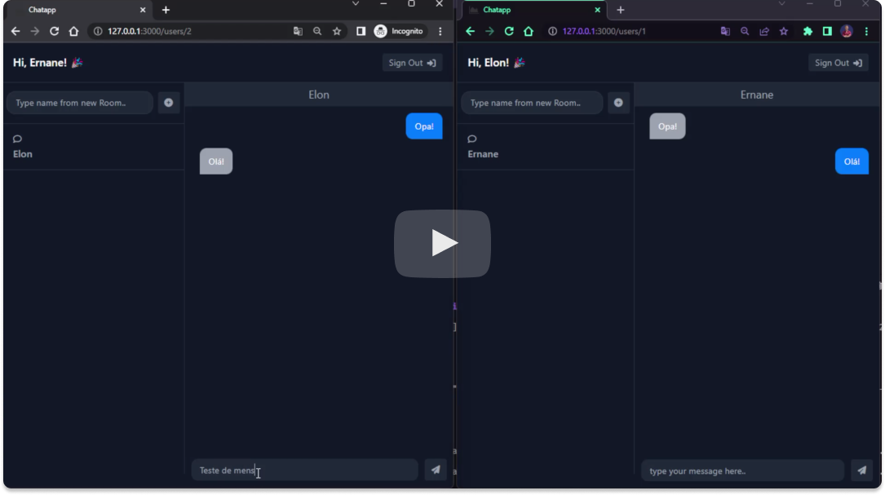

<h1 align="center">
  <strong>ChatAPP 💬</strong>
</h1>

  

  

## 💻 Project

Project built based on the intention of studying the operation of turbo rails. Your goal is to build a simple user login system designed for real-time conversations. In public, group, or private user-to-user chats.

  Developed with ❤ by <a target="_blank" href="https://ernanej.github.io/my-linktree/">Ernane Ferreira</a>. 👋🏻

